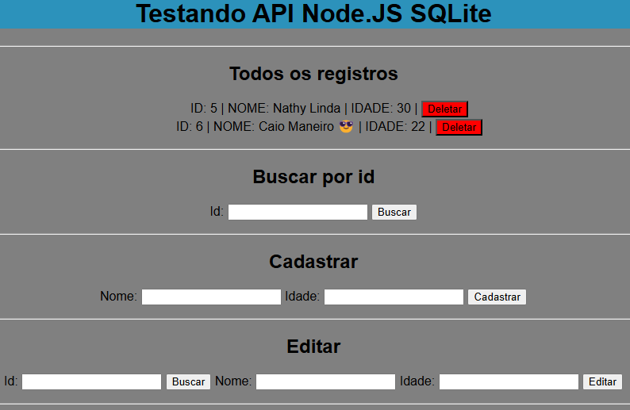

# API Node.js com SQLite e Frontend Simples



Este é um projeto de uma API desenvolvida em **Node.js** com **banco de dados SQLite**, acompanhada de um **frontend simples** em HTML e JavaScript para testar a API.

## Estrutura do Projeto

- **Backend (API)**: Desenvolvido em **Node.js** com **SQLite**.
- **Frontend (Testes)**: Uma pasta `simple` com um frontend básico em HTML e JavaScript para interação com a API.


## Como Rodar o Projeto

### Pré-requisitos

Antes de rodar o projeto, é necessário ter o **Node.js** e o **npm** instalados em sua máquina. Você pode verificar se já possui essas ferramentas instaladas com os seguintes comandos:

```bash
node -v
npm -v
```
### instalardependências

```bash
npm install

```
### Rodar a API

```bash
npm run dev

```
### Acesse o index.html dentro da pasta do frontEnd;